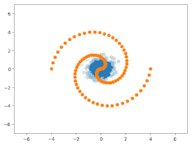

# tf-exercise-gan

Tensorflow implementation and benchmark of diffrent GANs

## GAN implementations

- [x] **DCGAN** from 'Unsupervised Representation Learning with Deep Convolutional Generative Adversarial Networks' (https://arxiv.org/abs/1511.06434)
- [x] **WGAN** from 'Wasserstein GAN' (https://arxiv.org/abs/1701.07875)
- [x] **BEGAN** from 'BEGAN: Boundary Equilibrium Generative Adversarial Networks' (https://arxiv.org/abs/1703.10717)
- [x] **MAD-GAN** from 'Multi-Agent Diverse Generative Adversarial Networks' (https://arxiv.org/abs/1704.02906)
- [x] **GoGAN** from 'Gang of GANs: Generative Adversarial Networks with Maximum Margin Ranking' (https://arxiv.org/abs/1704.04865)
- [ ] ...

## Tasks

- [x] Impl. DCGAN, GoGAN, WGAN
- [x] Impl. BEGAN, MAD-GAN
- [x] Reproduce GANs on MNIST and CelebA datasets
- [x] Impl. training & evaluation on synthetic datasets
- [x] Add sample results
- [ ] Impl. better evaluation function for real images (e.g. IvOM, energy dist., ...)
- [ ] Impl. a result logger
- [ ] Compare GANs (synthetic and MNIST)
- [ ] Add more GAN implementations

## Experiments & Benchmarks

170718 / [Comparison of different GAN models on synthetic datasets](assets/170718_synthetic/report_synthetic.md)

- Done without any hyper-parameter search.
- MAD-GAN worked best in the tested datasets.
- 

170718 / [Sample results on MNIST and CelebA datasets](assets/170718_mnist_and_celeba/samples.md)

- 
